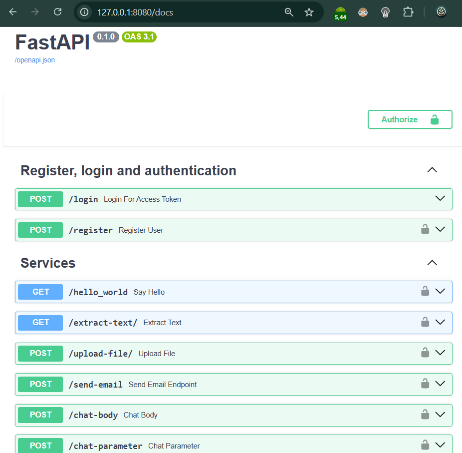

# API de Autenticação & Integração — FastAPI + Firestore

> Backend exemplo (POC/MVP) com Clean Architecture para registro, login (JWT), upload/extract de PDFs, envio de e-mail via SMTP e integração com um LLM (Cohere). Implementado em Python (FastAPI) e empacotado com Poetry. Deploy demo feito no Railway.

---

## Índice
- [Visão Geral](#visão-geral)  
- [Features](#features)  
- [Arquitetura do Projeto](#arquitetura-do-projeto)  
- [Requisitos](#requisitos)  
- [Instalação & Execução (Local)](#instalação--execução-local)  
- [Docker](#docker)  
- [Variáveis de Ambiente](#variáveis-de-ambiente)  
- [Endpoints Principais / Exemplos de Uso](#endpoints-principais--exemplos-de-uso)  
- [Testes](#testes)  
- [Deploy (nota)](#deploy-nota)  
- [Próximos passos / melhorias](#próximos-passos--melhorias)  
- [Licença](#licença)

---

## Visão Geral
Essa API foi criada para demonstrar uma implementação prática de autenticação/autorizaçao integrada com Firestore, além de endpoints utilitários que suportam fluxos comuns em aplicações de dados. A estrutura segue princípios da Clean Architecture para facilitar manutenção, testes e evolução.



---

## Features
- Registro de usuário persistido no **Firestore**.  
- Login com **JWT** e proteção de rotas.  
- Rate limiter no endpoint de login.  
- Upload de arquivos + extração de texto de PDFs.  
- Envio de e-mail via SMTP (Gmail).  
- Endpoints de integração com modelo LLM (Cohere) — `chat-body` e `chat-parameter`.  
- Estrutura modular (`src/models`, `src/services`, `src/api`, `src/utils`).  
- `Dockerfile` e configuração com `Poetry`.

---

## Arquitetura do Projeto (resumo)
/ (repo root)
├─ .gitignore
├─ Dockerfile
├─ pyproject.toml (Poetry)
├─ src/
│ ├─ api/ # endpoints / routes
│ ├─ models/ # Pydantic models / schemas
│ ├─ services/ # lógica de negócio (auth, firestore, llm, pdf, email)
│ ├─ utils/ # helpers (security, config, storage)
│ └─ notebooks/ # notebooks (se houver)
└─ tests/


---

## Requisitos
- Python 3.10+  
- Poetry  
- Docker (opcional)  
- Conta Firestore (Google Cloud) com credenciais (service account JSON) — para rodar as integrações reais.

---

## Instalação & Execução (Local)
1. Clone o repositório:
```bash
git clone <repo-url>
cd projeto-api


2. Instale dependências com Poetry:
poetry install
poetry env activate


3. Copie e ajuste variáveis de ambiente:
cp .env.example .env
# editar .env com credenciais (Firestore, SMTP, JWT secret, COHERE_API_KEY, etc)


4. Rodar localmente:
poetry run python main.py
Abra http://localhost:8000/docs para ver a documentação automática (Swagger/OpenAPI).


Docker

Build:

docker build -t projeto-api:latest .


Run (exemplo):

docker run --env-file .env -p 8000:8000 projeto-api:latest


Variáveis de Ambiente (.env.example)
# JWT
JWT_SECRET=troque_por_segredo_forte
JWT_ALGORITHM=HS256
JWT_EXP_MINUTES=60

# Firestore
GOOGLE_APPLICATION_CREDENTIALS=/path/to/service-account.json
FIRESTORE_PROJECT_ID=seu_project_id

# SMTP (Gmail exemplo)
SMTP_HOST=smtp.gmail.com
SMTP_PORT=587
SMTP_USER=seu_email@gmail.com
SMTP_PASSWORD=sua_senha_app

# Cohere
COHERE_API_KEY=insira_cohere_key_aqui

# Outros
RATE_LIMIT_LOGIN=5/minute


Endpoints Principais & Exemplos (curl)

Abra http://localhost:8000/docs para documentação interativa.

Registro
curl -X POST http://localhost:8000/register \
  -H "Content-Type: application/json" \
  -d '{"email":"teste@dominio.com","password":"Senha123"}'

Login (retorna JWT)
curl -X POST http://localhost:8000/login \
  -H "Content-Type: application/json" \
  -d '{"email":"teste@dominio.com","password":"Senha123"}'

Endpoint protegido (ex: hello_world)
curl -X GET http://localhost:8000/hello_world \
  -H "Authorization: Bearer <JWT_TOKEN>"

Upload de arquivo (multipart/form-data)
curl -X POST http://localhost:8000/upload-file \
  -H "Authorization: Bearer <JWT_TOKEN>" \
  -F "file=@/caminho/arquivo.pdf"

Extrair texto (se houver endpoint que recebe PDF)
curl -X POST http://localhost:8000/extract-text \
  -H "Authorization: Bearer <JWT_TOKEN>" \
  -F "file=@/caminho/arquivo.pdf"

Enviar email via SMTP
curl -X POST http://localhost:8000/send-email \
  -H "Content-Type: application/json" \
  -d '{"to":"cliente@dominio.com","subject":"Teste","body":"Olá"}'

Chat via LLM (Ex.: chat-body)
curl -X POST http://localhost:8000/chat-body \
  -H "Content-Type: application/json" \
  -d '{"prompt":"Resuma o texto X..."}'

Testes

Rode o suite (exemplo):

poetry run pytest -q


(Assegure-se de configurar variáveis de ambiente de teste ou mocks para Firestore/SMTP/LLM.)


Deploy

Demo feito em Railway (trial).

Para produção: use secrets managers (GCP Secret Manager / GitHub Actions secrets), configure CI/CD e revise limitações de escalabilidade do Firestore e quota do SMTP.

Segurança e observações

JWT secret deve ser forte e rotacionável.

Rate limiter em login é essencial; avalie proteção adicional (captcha, MFA).

Não armazenar senhas em texto; sempre hashear com bcrypt/argon2.

Firestore: regras e permissões de service account restritas.

Logs: evite registrar tokens/senhas em logs.

Próximos passos / melhorias

Adicionar CI/CD (tests → build → deploy automático).

Implementar integração com OAuth providers (Microsoft / Google) para SSO.

Adicionar métricas e monitoramento (Prometheus / Grafana).

Substituir SMTP direto por provider de e-mail (SendGrid / Amazon SES) para entrega robusta.

[Client (Web / Mobile)]
        |
        v
[API Gateway / FastAPI (src/api)]
  - Auth (login/register)
  - Protected endpoints (hello, extract-text, upload, chat)
        |
        v
[Services Layer (src/services)]
  - AuthService (JWT)
  - FirestoreService (users)
  - PDFService (extract text)
  - EmailService (SMTP)
  - LLMService (Cohere)
        |
        v
[External]
  - Firestore (Google Cloud)
  - SMTP (Gmail)
  - LLM Provider (Cohere)
  - Storage (local / cloud)
